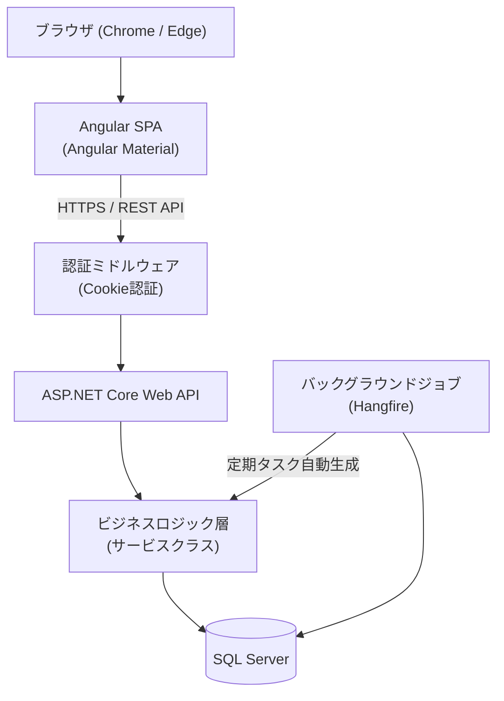
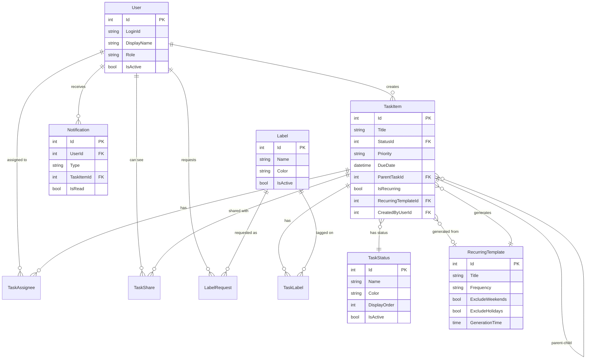
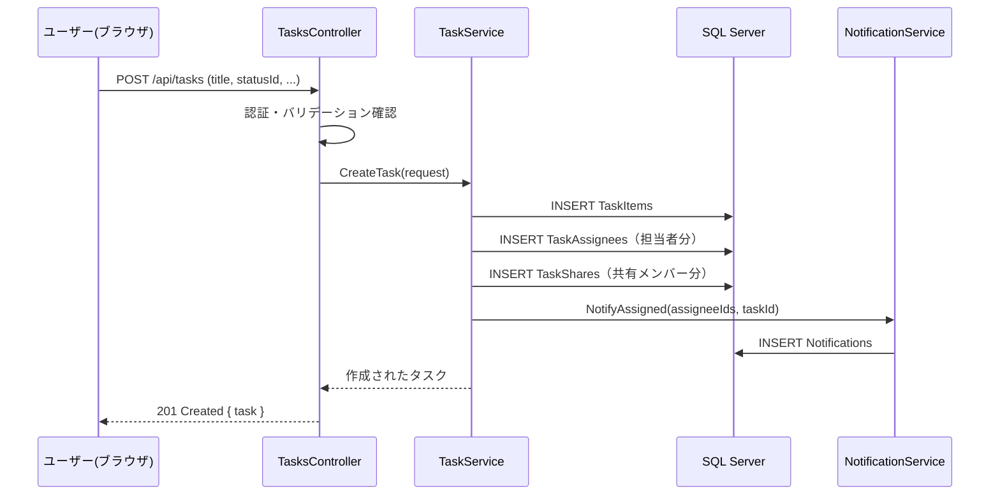
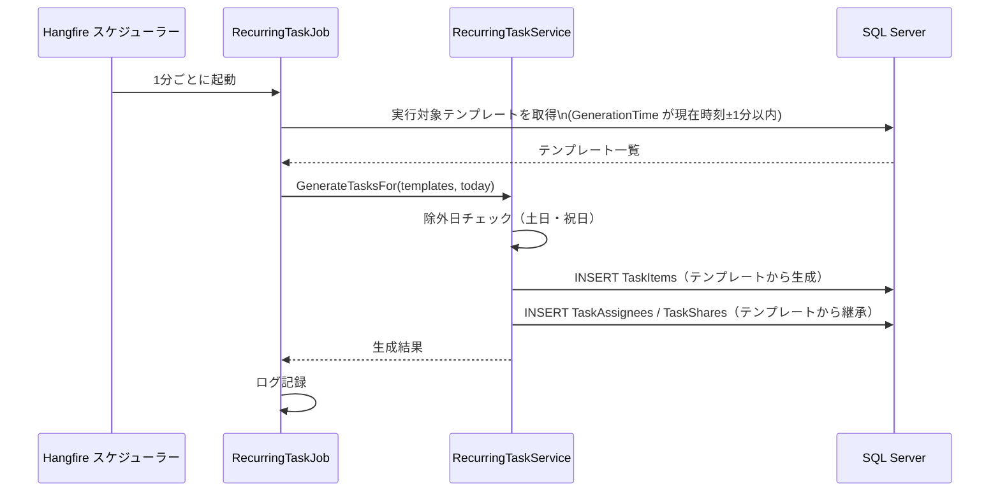
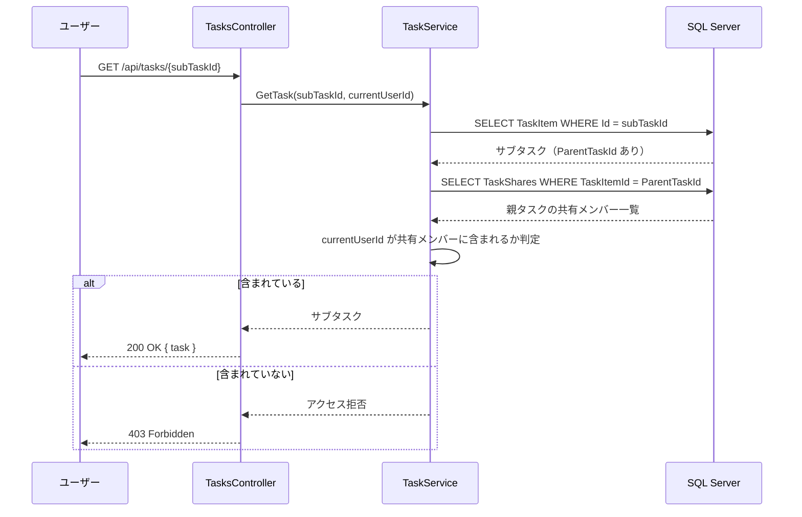
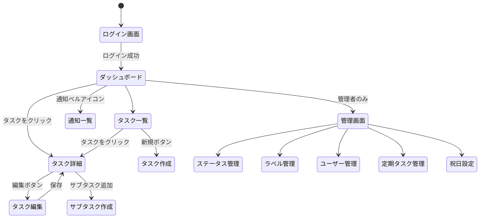

# 機能設計書 (Functional Design Document)

## システム構成図



## 技術スタック

| 分類 | 技術 | 選定理由 |
|------|------|----------|
| フロントエンド | Angular + Angular Material | 型安全・コンポーネント設計・社内既存スキル |
| バックエンド | ASP.NET Core (C#) | 長期メンテ性・Web API との相性・社内主軸技術 |
| データベース | SQL Server | 社内標準DB・トランザクション・全文検索 |
| 認証 | Cookie認証 (ASP.NET Core) | イントラネット運用・セッション管理の標準実装 |
| バックグラウンドジョブ | Hangfire | 管理UI標準装備・再試行・スケジュール管理 |
| 実行環境 | Windows Server + IIS | 社内既存インフラを流用 |

---

## データモデル定義

### エンティティ: User（ユーザー）

```csharp
public class User
{
    public int Id { get; set; }
    public string LoginId { get; set; }       // ログインID（一意）
    public string DisplayName { get; set; }   // 表示名
    public string PasswordHash { get; set; }  // bcryptハッシュ
    public UserRole Role { get; set; }        // Admin / Member
    public bool IsActive { get; set; }        // 有効/無効
    public DateTime CreatedAt { get; set; }
    public DateTime UpdatedAt { get; set; }
}

public enum UserRole { Admin, Member }
```

---

### エンティティ: TaskItem（タスク）

```csharp
public class TaskItem
{
    public int Id { get; set; }
    public string Title { get; set; }           // 必須・最大200文字
    public string? Description { get; set; }    // 任意
    public int StatusId { get; set; }           // FK → TaskStatus
    public TaskPriority Priority { get; set; }  // High / Medium / Low
    public DateTime? DueDate { get; set; }      // 期限（任意）
    public int? ParentTaskId { get; set; }      // FK → TaskItem（サブタスク）
    public bool IsRecurring { get; set; }       // 定期タスクフラグ
    public int? RecurringTemplateId { get; set; } // FK → RecurringTemplate
    public int CreatedByUserId { get; set; }    // FK → User
    public DateTime CreatedAt { get; set; }
    public DateTime UpdatedAt { get; set; }

    // ナビゲーションプロパティ
    public TaskStatus Status { get; set; }
    public TaskItem? ParentTask { get; set; }
    public ICollection<TaskItem> SubTasks { get; set; }
    public ICollection<TaskAssignee> Assignees { get; set; }
    public ICollection<TaskLabel> TaskLabels { get; set; }
    public ICollection<TaskShare> Shares { get; set; }
}

public enum TaskPriority { High, Medium, Low }
```

**制約**:
- `Title`: 1〜200文字、必須
- `ParentTaskId` が設定されている場合はサブタスク扱い
- `IsRecurring = true` のタスクはテンプレートから自動生成されたもの

---

### エンティティ: TaskStatus（ステータス）

```csharp
public class TaskStatus
{
    public int Id { get; set; }
    public string Name { get; set; }      // 例: "未着手"・"進行中"
    public string Color { get; set; }     // HEXカラーコード（バッジ色）
    public int DisplayOrder { get; set; } // 表示順
    public bool IsActive { get; set; }    // 論理削除フラグ
    public DateTime CreatedAt { get; set; }
    public DateTime UpdatedAt { get; set; }
}
```

**初期データ**:
| 名前 | 色 | 順序 |
|------|-----|------|
| 未着手 | #9E9E9E | 1 |
| 進行中 | #2196F3 | 2 |
| レビュー中 | #FF9800 | 3 |
| 保留 | #F44336 | 4 |
| 完了 | #4CAF50 | 5 |

---

### エンティティ: Label（ラベル）

```csharp
public class Label
{
    public int Id { get; set; }
    public string Name { get; set; }   // 一意・最大50文字
    public string Color { get; set; }  // HEXカラーコード
    public bool IsActive { get; set; }
    public DateTime CreatedAt { get; set; }
    public DateTime UpdatedAt { get; set; }
}
```

---

### エンティティ: TaskAssignee（タスク担当者）

```csharp
public class TaskAssignee
{
    public int TaskItemId { get; set; }   // FK → TaskItem
    public int UserId { get; set; }       // FK → User
    public DateTime AssignedAt { get; set; }
}
```

---

### エンティティ: TaskLabel（タスク-ラベル 中間テーブル）

```csharp
public class TaskLabel
{
    public int TaskItemId { get; set; }  // FK → TaskItem
    public int LabelId { get; set; }     // FK → Label
}
```

---

### エンティティ: TaskShare（タスク共有範囲）

```csharp
public class TaskShare
{
    public int TaskItemId { get; set; }  // FK → TaskItem
    public int UserId { get; set; }      // FK → User
}
```

**ルール**:
- サブタスクは親タスクの `TaskShare` を自動継承する（サブタスク自体には `TaskShare` レコードを持たない）
- 取得時に親タスクの共有設定を参照して公開可否を判定する

---

### エンティティ: RecurringTemplate（定期タスクテンプレート）

```csharp
public class RecurringTemplate
{
    public int Id { get; set; }
    public string Title { get; set; }
    public string? Description { get; set; }
    public TaskPriority Priority { get; set; }
    public RecurringFrequency Frequency { get; set; }   // Daily/Weekly/Monthly
    public int[]? WeekDays { get; set; }                // 週次の場合: [0=日, 1=月, ...]
    public int? DayOfMonth { get; set; }               // 月次の場合: 1〜31
    public bool ExcludeWeekends { get; set; }
    public bool ExcludeHolidays { get; set; }
    public TimeSpan GenerationTime { get; set; }        // 生成時刻（例: 08:00）
    public bool IsActive { get; set; }
    public int CreatedByUserId { get; set; }
    public DateTime CreatedAt { get; set; }
    public DateTime UpdatedAt { get; set; }
}

public enum RecurringFrequency { Daily, Weekly, Monthly }
```

---

### エンティティ: Notification（通知）

```csharp
public class Notification
{
    public int Id { get; set; }
    public int UserId { get; set; }              // FK → User（通知先）
    public NotificationType Type { get; set; }   // Assigned / Overdue
    public int? TaskItemId { get; set; }         // FK → TaskItem
    public string Message { get; set; }
    public bool IsRead { get; set; }
    public DateTime CreatedAt { get; set; }
}

public enum NotificationType { Assigned, Overdue }
```

---

### エンティティ: LabelRequest（タグ追加リクエスト）

```csharp
public class LabelRequest
{
    public int Id { get; set; }
    public int RequestedByUserId { get; set; }  // FK → User
    public string RequestedName { get; set; }
    public string? Reason { get; set; }
    public LabelRequestStatus Status { get; set; }  // Pending / Approved / Rejected
    public DateTime CreatedAt { get; set; }
    public DateTime UpdatedAt { get; set; }
}

public enum LabelRequestStatus { Pending, Approved, Rejected }
```

---

### ER図



---

## コンポーネント設計

### バックエンド層構成

```
Controller（HTTPリクエスト受付・レスポンス）
    ↓
Service（ビジネスロジック）
    ↓
Repository（データアクセス / Entity Framework Core）
    ↓
SQL Server
```

### コントローラー一覧

| コントローラー | 主な責務 | 実装済み |
|---|---|---|
| `AuthController` | ログイン・ログアウト・パスワード変更 | ✅ |
| `TasksController` | タスクのCRUD・フィルター・検索・共有ユーザー追加削除 | ✅ |
| `StatusesController` | ステータスの管理（管理者のみ） | ✅ |
| `LabelsController` | ラベルの管理（管理者のみ） | ✅ |
| `UsersController` | ユーザー管理（管理者のみ） | ✅ |
| `RecurringTemplatesController` | 定期タスクテンプレートのCRUD | 未実装 |
| `NotificationsController` | 通知一覧・既読処理 | 未実装 |

### サービスクラス一覧

| サービス | 責務 | 実装済み |
|---|---|---|
| `TaskService` | タスクCRUD・共有範囲チェック・サブタスク継承ロジック・共有ユーザー個別追加削除 | ✅ |
| `StatusService` | ステータス管理・論理削除時の影響チェック | ✅ |
| `LabelService` | ラベル管理 | ✅ |
| `UserService` | アカウント管理・パスワードハッシュ | ✅ |
| `RecurringTaskService` | テンプレートからのタスク自動生成ロジック | 未実装 |
| `NotificationService` | 通知生成（担当割当・期限超過） | 未実装 |

### 実装済みエンティティ（2026-05-04 時点）

- `User`, `UserRole`
- `TaskStatus`（HasData シードで初期5件投入）
- `Label`
- `TaskItem`（親子ツリー構造、`ParentTaskId` FK）
- `TaskAssignee`（タスク-ユーザー 中間）
- `TaskLabel`（タスク-ラベル 中間）
- `TaskShare`（閲覧権限管理）

### サブタスク共有範囲の実装ルール

- サブタスク（`ParentTaskId != null`）は自身の `TaskShare` レコードを持たない
- 閲覧権限チェック時は親タスクの `TaskShare` を参照する
- 一覧取得クエリ（`TaskRepository.GetListAsync`）もサブタスクに対して親の `TaskShare` を確認する

---

## ユースケース図（シーケンス）

### タスク新規登録



---

### 定期タスク自動生成（バックグラウンド）



---

### 共有範囲の継承（サブタスク参照時）



---

## 画面遷移図



---

## API設計

### 認証

#### POST /api/auth/login
```json
// リクエスト
{ "loginId": "tanaka", "password": "p@ssw0rd" }

// レスポンス 200
{ "userId": 1, "displayName": "田中", "role": "Member" }

// エラー
// 401 Unauthorized: 認証失敗
```

#### GET /api/auth/me
```json
// レスポンス 200（認証済みの場合）
{ "userId": 1, "displayName": "田中", "role": "Member" }

// エラー
// 401 Unauthorized: 未認証（Cookie なし or 期限切れ）
```

#### POST /api/auth/logout
```
// レスポンス 200 No Content
```

---

### タスク

#### GET /api/tasks
クエリパラメーター: `statusId`, `assigneeId`, `labelId`, `priority`, `isRecurring`, `search`, `dueBefore`, `dueAfter`, `page`, `pageSize`

```json
// レスポンス 200
{
  "items": [
    {
      "id": 1,
      "title": "API設計レビュー",
      "status": { "id": 2, "name": "進行中", "color": "#2196F3" },
      "priority": "High",
      "dueDate": "2026-05-10",
      "assignees": [{ "id": 1, "displayName": "田中" }],
      "labels": [{ "id": 3, "name": "開発", "color": "#8BC34A" }],
      "subTaskCount": 2,
      "isRecurring": false
    }
  ],
  "totalCount": 42,
  "page": 1,
  "pageSize": 20
}
```

#### POST /api/tasks
```json
// リクエスト
{
  "title": "API設計レビュー",
  "description": "詳細は...",
  "statusId": 1,
  "priority": "High",
  "dueDate": "2026-05-10",
  "parentTaskId": null,
  "assigneeIds": [1, 2],
  "labelIds": [3],
  "shareUserIds": [1, 2, 3]
}

// レスポンス 201 Created
{ "id": 10, ... }

// エラー
// 400 Bad Request: バリデーションエラー（titleが空など）
// 403 Forbidden: 権限なし
```

#### GET /api/tasks/{id}
```json
// レスポンス 200
{
  "id": 10,
  "title": "API設計レビュー",
  "description": "詳細は...",
  "status": { "id": 2, "name": "進行中", "color": "#2196F3" },
  "priority": "High",
  "dueDate": "2026-05-10",
  "parentTask": null,
  "subTasks": [{ "id": 11, "title": "サブタスク1", ... }],
  "assignees": [{ "id": 1, "displayName": "田中" }],
  "labels": [{ "id": 3, "name": "開発" }],
  "shareUsers": [{ "id": 1, "displayName": "田中" }, { "id": 2, "displayName": "佐藤" }],
  "createdAt": "2026-05-01T09:00:00Z"
}

// エラー
// 403 Forbidden: 閲覧権限なし
// 404 Not Found: タスク存在しない
```

#### PUT /api/tasks/{id}
```json
// リクエスト（変更するフィールドのみ送信可）
{ "statusId": 3, "priority": "Medium" }

// レスポンス 200 OK { task }
// エラー
// 403 Forbidden / 404 Not Found
```

#### DELETE /api/tasks/{id}
```
// レスポンス 204 No Content
// エラー: 403 / 404
```

---

### ステータス（管理者のみ）

#### GET /api/statuses → `[{ id, name, color, displayOrder, isActive }]`
#### POST /api/statuses → 201
#### PUT /api/statuses/{id} → 200
#### DELETE /api/statuses/{id} → 論理削除（使用中タスクがある場合は 409 Conflict）

---

### ラベル

#### GET /api/labels → `[{ id, name, color, isActive }]`
#### POST /api/labels → 管理者のみ・201
#### POST /api/labels/requests → ユーザーがリクエスト送信
#### GET /api/labels/requests → 管理者のみ・一覧取得
#### PUT /api/labels/requests/{id} → 管理者が承認・却下

---

### 通知

#### GET /api/notifications
```json
// レスポンス 200
{
  "items": [
    { "id": 1, "type": "Assigned", "message": "「API設計レビュー」に担当者として追加されました", "isRead": false, "createdAt": "..." }
  ],
  "unreadCount": 3
}
```

#### PUT /api/notifications/{id}/read → 200
#### PUT /api/notifications/read-all → 200

---

### ユーザー（管理者のみ）

#### GET /api/users → ユーザー一覧
#### POST /api/users → アカウント作成
#### PUT /api/users/{id} → 更新（有効化・無効化含む）
#### PUT /api/users/me/profile → 自分のプロフィール更新（一般ユーザー可）
#### PUT /api/users/me/password → パスワード変更（一般ユーザー可）

---

### 定期タスクテンプレート（管理者のみ）

#### GET /api/recurring-templates → 一覧
#### POST /api/recurring-templates → 作成
#### PUT /api/recurring-templates/{id} → 更新
#### DELETE /api/recurring-templates/{id} → 無効化

---

## UI設計

### ダッシュボード構成

```
┌─────────────────────────────────────────────────────────┐
│  TaskApp           [通知ベル 3]  [田中 ▼]              │
├─────────────────────────────────────────────────────────┤
│  マイタスク                                              │
│  ┌──────────────────────────────────────────────────┐   │
│  │ [進行中] API設計レビュー    期限: 05/10  優先度:高 │   │
│  │ [未着手] 月次報告書作成     期限: 05/31  優先度:中 │   │
│  └──────────────────────────────────────────────────┘   │
│  チーム共有タスク                                         │
│  ┌──────────────────────────────────────────────────┐   │
│  │ 担当者   タスク名           ステータス    期限      │   │
│  │ 田中     API設計レビュー    進行中        05/10    │   │
│  │ 佐藤     テスト計画作成     未着手        05/15    │   │
│  └──────────────────────────────────────────────────┘   │
└─────────────────────────────────────────────────────────┘
```

### カラーコーディング

| 用途 | 色 |
|---|---|
| 期限超過タスク | 赤 (#F44336) でハイライト |
| 優先度: 高 | 赤バッジ |
| 優先度: 中 | 橙バッジ |
| 優先度: 低 | 青バッジ |
| ステータス色 | 管理者が設定したHEXカラー |

### フィルターパネル（タスク一覧）

```
[担当者 ▼] [ステータス ▼] [優先度 ▼] [ラベル ▼] [期限範囲] [定期タスクを表示]
[検索: フリーワード___________________________]
```

---

## バックグラウンドジョブ設計

### 定期タスク生成ジョブ

- **スケジュール**: 毎分実行（Hangfire の RecurringJob）
- **処理内容**:
  1. `RecurringTemplate` から `GenerationTime` が「現在時刻±1分」に該当するアクティブなテンプレートを取得
  2. 除外日判定（土日フラグ・祝日テーブル照合）
  3. 当日分がすでに生成済みでないか確認（重複防止）
  4. `TaskItem` を生成し担当者・共有設定を引き継ぐ
  5. 実行ログを記録

### 期限超過通知ジョブ

- **スケジュール**: 毎日 00:05 実行
- **処理内容**:
  1. 期限日が前日以前・ステータスが「完了」以外のタスクを取得
  2. 担当者ごとに通知レコードを生成（同日に既に通知済みのものはスキップ）

---

## エラーハンドリング

### エラー種別と処理

| エラー種別 | HTTPステータス | 処理 | ユーザーへの表示 |
|---|---|---|---|
| バリデーションエラー | 400 | 処理中断 | フィールドごとのエラーメッセージ |
| 未認証 | 401 | ログイン画面へリダイレクト | — |
| 権限なし | 403 | 処理中断 | 「このタスクを閲覧する権限がありません」 |
| リソース不在 | 404 | 処理中断 | 「タスクが見つかりませんでした」 |
| 競合（論理削除できない） | 409 | 処理中断 | 「使用中のため削除できません」 |
| サーバーエラー | 500 | エラーログ記録 | 「エラーが発生しました。管理者にご連絡ください」 |

- Angular側では `HttpInterceptor` で401を検知し自動リダイレクト
- 500エラーはサーバー側でログファイル・Windowsイベントログへ記録

---

## テスト戦略

### ユニットテスト（xUnit + Moq）

- `TaskService`: 共有範囲チェック・サブタスク継承ロジック
- `RecurringTaskService`: 除外日判定・重複生成防止
- `NotificationService`: 通知生成条件

### 統合テスト（ASP.NET Core TestServer）

- タスクCRUD APIのエンドツーエンド（DBはInMemoryまたはSQLite）
- 認証・認可のテスト（管理者のみエンドポイントへの一般ユーザーアクセス）

### E2Eテスト（Playwright）

- ログイン → タスク作成 → 担当者割り当て → ステータス更新 → 完了
- 定期タスクフィルター切り替えの動作確認

---

## セキュリティ考慮事項

| 項目 | 対策 |
|---|---|
| パスワード保存 | BCrypt（コスト係数12以上）でハッシュ化 |
| セッション管理 | HTTP-only Cookie・SameSite=Strict |
| XSS対策 | Angular のテンプレートバインディングによる自動エスケープ |
| CSRF対策 | ASP.NET Core の AntiForgery トークン（Cookie+ヘッダー方式） |
| 認可 | API レベルで `[Authorize]` + 公開範囲チェックをサービス層で実施 |
| HTTPS | IIS で TLS 1.2 以上を強制、HTTPリダイレクト設定 |
| SQLインジェクション | Entity Framework Core のパラメータバインディングで防止 |

---

## パフォーマンス最適化

| 対策 | 説明 |
|---|---|
| インデックス設計 | `TaskItems(StatusId)`, `TaskItems(DueDate)`, `TaskAssignees(UserId)`, `TaskShares(UserId)` にインデックスを設定 |
| ページネーション | タスク一覧は常にページネーション（最大100件/ページ） |
| 遅延読み込み回避 | EF Core で必要なナビゲーションプロパティのみ `Include` |
| バックグラウンドジョブ | タスク生成・通知送信は非同期ジョブで処理し、APIレスポンスをブロックしない |
